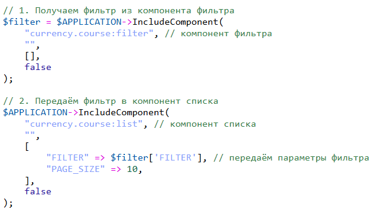
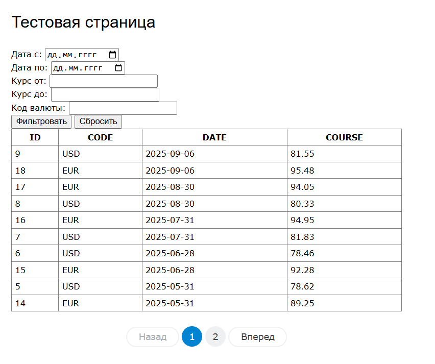
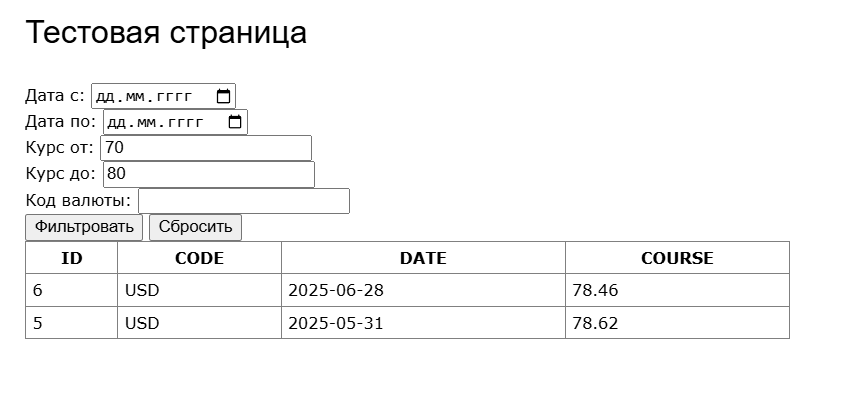

# Таблица валют с фильтром

## Описание
Модуль для Bitrix, который содержит в себе два компонента (Фильтр и список) для вывода и фильтрации курса валют.
Моудуль разработан в рамках тестового задания. 

Использует D7.

## Установка

Модуль можно установить и удалить как из директории local/modules, так и bitrix/modules.

## Использование

### Вставьте код фильтра и списка на страницу

 
### Результат

